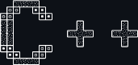

<a id="readme-top"></a>


<!-- PROJECT SHIELDS -->
<!--
*** I'm using markdown "reference style" links for readability.
*** Reference links are enclosed in brackets [ ] instead of parentheses ( ).
*** See the bottom of this document for the declaration of the reference variables
*** for contributors-url, forks-url, etc. This is an optional, concise syntax you may use.
*** https://www.markdownguide.org/basic-syntax/#reference-style-links
-->
[![Contributors][contributors-shield]][contributors-url]
[![Forks][forks-shield]][forks-url]
[![Stargazers][stars-shield]][stars-url]
[![Issues][issues-shield]][issues-url]
[![GPL License][license-shield]][license-url]
[![LinkedIn][linkedin-shield]][linkedin-url]


<!-- PROJECT LOGO -->
<br />
<div align="center">
  <a href="https://github.com/JacobNickerson/cetris">
    
  </a>

<h3 align="center">Cetris</h3>

  <p align="center">
    A tetromino-based gravity puzzle game! Cetris is programmed entirely in C++ using SFML for graphical and audio rendering. 
    Boasting seven different unique tetrominos, Cetris challenges your spatial skills and quick-thinking. Use WASD for translation, Q/E for rotation, and SPACE for hard drops. 
    The game level increases after more and more lines are cleared, increasing the speed of gravity but also the points earned. How high can you score?
  </p>
    <br />
    <a href="https://github.com/JacobNickerson/cetris"><strong>Explore the docs »</strong></a>
    <br />
    <br />
    <a href="https://github.com/JacobNickerson/cetris">View Demo</a>
    ·
    <a href="https://github.com/JacobNickerson/cetris/issues/new?labels=bug&template=bug-report---.md">Report Bug</a>
    ·
    <a href="https://github.com/JacobNickerson/cetris/issues/new?labels=enhancement&template=feature-request---.md">Request Feature</a>
</div>


<!-- TABLE OF CONTENTS -->
<details>
  <summary>Table of Contents</summary>
  <ol>
    <li>
      <a href="#about-the-project">About The Project</a>
      <ul>
        <li><a href="#built-with">Built With</a></li>
      </ul>
    </li>
    <li>
      <a href="#getting-started">Getting Started</a>
      <ul>
        <li><a href="#prerequisites">Prerequisites</a></li>
        <li><a href="#installation">Installation</a></li>
      </ul>
    </li>
    <li><a href="#usage">Usage</a></li>
    <li><a href="#roadmap">Roadmap</a></li>
    <li><a href="#contributing">Contributing</a></li>
    <li><a href="#license">License</a></li>
    <li><a href="#contact">Contact</a></li>
    <li><a href="#acknowledgments">Acknowledgments</a></li>
  </ol>
</details>


<!-- ABOUT THE PROJECT -->
## About The Project

[![Product Name Screen Shot][product-screenshot]](https://example.com)


<p align="right">(<a href="#readme-top">back to top</a>)</p>


### Built With

* [![C++][Isocpp.org]][C++-url]
* [![SFML][SFML-dev.org]][SFML-url]

<p align="right">(<a href="#readme-top">back to top</a>)</p>


<!-- GETTING STARTED -->
## Getting Started

To get a local copy up and running follow these simple example steps.

### Prerequisites

* WSL
  ```sh
  wsl --install
  ```

### Installation
Cetris was built using WSL (Ubuntu 22.04.2 LTS on Windows 10 x86_64). Your version may
    differ slightly, but should likely work so long as you have the `apt-get`
    package manager.
    
1. Clone the repo
   ```sh
   git clone https://github.com/JacobNickerson/cetris.git
   ```
2. Install packages with apt-get
   ```sh
   `sudo apt-get install libsfml-dev && sudo apt install make`
   ```
3. Compile and run using the included Makefile
   ```sh
   `make`
   ```

This should be sufficient. Most of the build process is automated in the Makefile.

<p align="right">(<a href="#readme-top">back to top</a>)</p>


<!-- USAGE EXAMPLES -->
## Usage

Use WASD for translation; Q/E for rotation; Space for hard drops
<br />
Clear lines by filling every space in a row. Score increases by clearing lines; clearing more lines in a single move will give increasingly more points.
<br />
Level progresses by clearing lines, as level increases, the speed of tetromino automatic falling increases. Clearing lines will grant more points at higher levels.
<br />
The next window showcases the next tetromino that will appear.

<p align="right">(<a href="#readme-top">back to top</a>)</p>


<!-- ROADMAP -->
## Roadmap

- [x] 1.0.0 Release
- [x] 1.1.0 Release
    - [x] Sticky Gravity

See the [open issues](https://github.com/JacobNickerson/cetris/issues) for a full list of proposed features (and known issues).

<p align="right">(<a href="#readme-top">back to top</a>)</p>


<!-- CONTRIBUTING -->
## Contributing

Contributions are what make the open source community such an amazing place to learn, inspire, and create. Any contributions you make are **greatly appreciated**.

If you have a suggestion that would make this better, please fork the repo and create a pull request. You can also simply open an issue with the tag "enhancement".
Don't forget to give the project a star! Thanks again!

1. Fork the Project
2. Create your Feature Branch (`git checkout -b feature/AmazingFeature`)
3. Commit your Changes (`git commit -m 'Add some AmazingFeature'`)
4. Push to the Branch (`git push origin feature/AmazingFeature`)
5. Open a Pull Request

<p align="right">(<a href="#readme-top">back to top</a>)</p>


<!-- LICENSE -->
## License

Distributed under the GPL-3.0 License. See `LICENSE` for more information.

<p align="right">(<a href="#readme-top">back to top</a>)</p>


<!-- CONTACT -->
## Contact

Jacob Nickerson - jacobnickerson817@gmail.com

Project Link: [https://github.com/JacobNickerson/cetris](https://github.com/JacobNickerson/cetris)

<p align="right">(<a href="#readme-top">back to top</a>)</p>


<!-- ACKNOWLEDGMENTS -->
## Acknowledgments

* [![Pixabay][Pixabay.com]][pixabay-url] - Royalty Free Sounds
* [![fontspace][fontspace.com]][fontspace-url] - Unlicensed Fonts
* [![musescore][musescore.com]][musescore-url] - Unlicensed Music Sheets

<p align="right">(<a href="#readme-top">back to top</a>)</p>


<!-- MARKDOWN LINKS & IMAGES -->
<!-- https://www.markdownguide.org/basic-syntax/#reference-style-links -->
[contributors-shield]: https://img.shields.io/github/contributors/JacobNickerson/cetris.svg?style=for-the-badge
[contributors-url]: https://github.com/JacobNickerson/cetris/graphs/contributors
[forks-shield]: https://img.shields.io/github/forks/JacobNickerson/cetris.svg?style=for-the-badge
[forks-url]: https://github.com/JacobNickerson/cetris/network/members
[stars-shield]: https://img.shields.io/github/stars/JacobNickerson/cetris.svg?style=for-the-badge
[stars-url]: https://github.com/JacobNickerson/cetris/stargazers
[issues-shield]: https://img.shields.io/github/issues/JacobNickerson/cetris.svg?style=for-the-badge
[issues-url]: https://github.com/JacobNickerson/cetris/issues
[license-shield]: https://img.shields.io/github/license/JacobNickerson/cetris.svg?style=for-the-badge
[license-url]: https://github.com/JacobNickerson/cetris/LICENSE
[linkedin-shield]: https://img.shields.io/badge/-LinkedIn-black.svg?style=for-the-badge&logo=linkedin&colorB=555
[linkedin-url]: https://linkedin.com/in/jacobnickerson817
[product-screenshot]: images/screenshot.png
[Isocpp.org]: https://img.shields.io/badge/C++-0769AD?style=for-the-badge&logo=cplusplus&logoColor=white
[C++-url]: https://isocpp.org/
[SFML-dev.org]: https://img.shields.io/badge/SFML-white?style=for-the-badge&logo=SFML&logoColor=8EC547
[SFML-url]: https://www.sfml-dev.org/
[Pixabay.com]: https://img.shields.io/badge/Pixabay-4CA84C?style=for-the-badge&logo=Pixabay&logoColor=white
[pixabay-url]: https://www.pixabay.com/
[fontspace.com]: https://img.shields.io/badge/fontspace-000000?style=for-the-badge&logo=fontspace&logoColor=white
[fontspace-url]: https://www.fontspace.com/
[musescore.com]: https://img.shields.io/badge/MuseScore-FFFFFF?style=for-the-badge&logo=MuseScore&logoColor=cyan
[musescore-url]: https://www.musescore.com/
